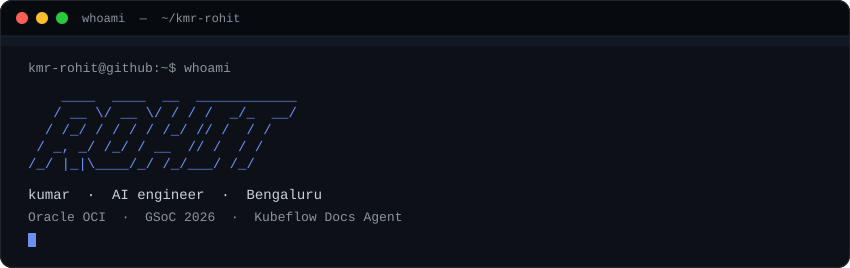
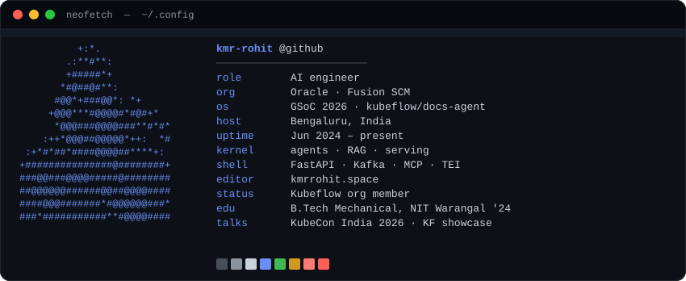
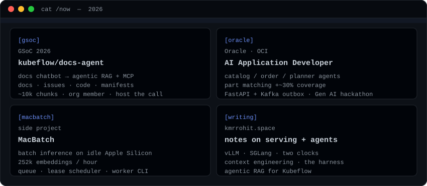
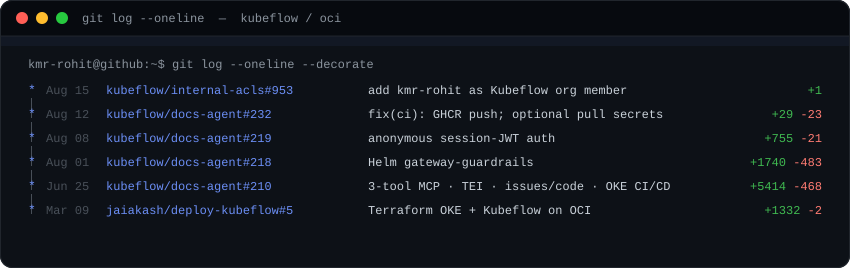
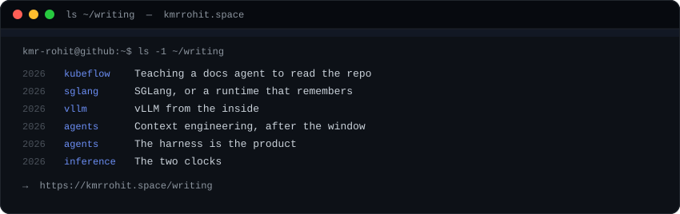
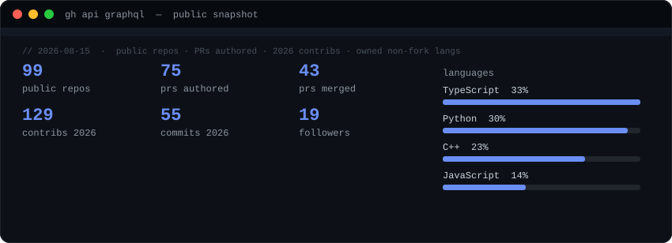

<!--
  kmr-rohit/kmr-rohit is a special repository: this README is
  https://github.com/kmr-rohit

  Cards are generated, not hand-tweaked:
    node scripts/generate.mjs
-->

  

  

I spend most of my time on the layer between a model and something someone will actually trust — tool-calling loops, retrieval, and the harness around them. By day that's agentic and RAG work inside Oracle Fusion SCM. Outside of that I work on [kubeflow/docs-agent](https://github.com/kubeflow/docs-agent) (GSoC 2026).

  <a href="https://kmrrohit.space">kmrrohit.space</a>
  ·
  <a href="https://github.com/kmr-rohit">github</a>
  ·
  <a href="https://www.linkedin.com/in/rr7433446/">linkedin</a>
  ·
  <a href="mailto:rr7433446@gmail.com">rr7433446@gmail.com</a>
  ·
  <a href="https://kmrrohit.space/rohit-kumar-resume-ai.pdf">résumé</a>

  

## `/now`

  

| where | what |
| :--- | :--- |
| [kubeflow/docs-agent](https://github.com/kubeflow/docs-agent) | GSoC 2026 — agentic RAG + MCP over docs, issues, code, manifests |
| Oracle Fusion SCM | catalog / order / planner agents · Alert Notification Microservice |
| [MacBatch](https://github.com/kmr-rohit/macbatch) · [app](https://macbatch.vercel.app/) | batch inference on idle Apple Silicon, 252k embeds/hour |
| [writing](https://kmrrohit.space/writing) · [projects](https://kmrrohit.space/projects) · [opensource](https://kmrrohit.space/opensource) | vLLM, SGLang, context, harness |

## `git log`

  

| merged | pr | note |
| :--- | :--- | :--- |
| Aug 15 | [kubeflow/internal-acls#953](https://github.com/kubeflow/internal-acls/pull/953) | org member |
| Aug 12 | [kubeflow/docs-agent#232](https://github.com/kubeflow/docs-agent/pull/232) | CI GHCR |
| Aug 08 | [kubeflow/docs-agent#219](https://github.com/kubeflow/docs-agent/pull/219) | session JWT |
| Aug 01 | [kubeflow/docs-agent#218](https://github.com/kubeflow/docs-agent/pull/218) | Helm gateway-guardrails |
| Jun 25 | [kubeflow/docs-agent#210](https://github.com/kubeflow/docs-agent/pull/210) | MCP + TEI + OKE CI/CD |
| Mar 09 | [jaiakash/deploy-kubeflow#5](https://github.com/jaiakash/deploy-kubeflow/pull/5) | Terraform OKE + Kubeflow |

## `~/writing`

  

- [Teaching a docs agent to read the repo](https://kmrrohit.space/writing/agentic-rag-for-kubeflow)
- [SGLang, or a runtime that remembers](https://kmrrohit.space/writing/sglang-architecture)
- [vLLM from the inside](https://kmrrohit.space/writing/vllm-architecture)
- [Context engineering, after the window stopped being the problem](https://kmrrohit.space/writing/context-engineering-for-agents)
- [The harness is the product](https://kmrrohit.space/writing/the-agentic-harness)
- [The two clocks](https://kmrrohit.space/writing/the-two-clocks)

## `gh stats`

Local snapshot (public GraphQL — not github-readme-stats.vercel.app).

  

  

  

  

<!-- Contribution snake: uncomment after the `snake` workflow has written to the `output` branch.

<picture>
  <source media="(prefers-color-scheme: dark)" srcset="https://raw.githubusercontent.com/kmr-rohit/kmr-rohit/output/github-contribution-grid-snake-dark.svg" />
  
</picture>
-->
